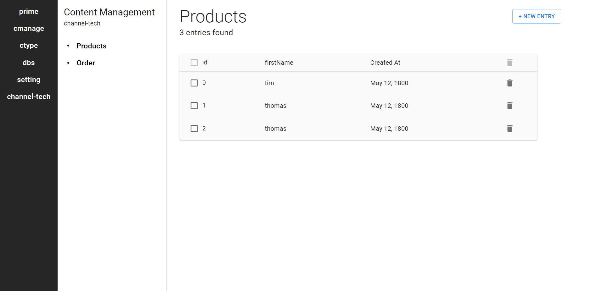

# Prime CMS

A dynamic content management system for personal projects. I am looking to add features such as multiple project management, CRUD operations, and content type creations.
Tech Stack - TypeScript, React, Node.js, Express.js, MongoDB (Will look to integrate GraphQL in the future)

A very rough mockup of the site is below. UI is not completely established, it is only meant to serve as a current click and push mockup to test all necessary features.

